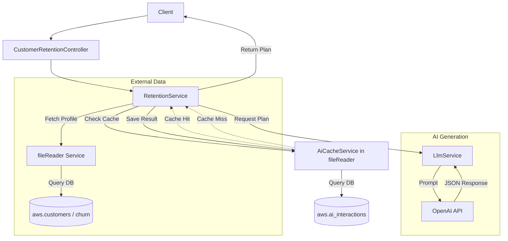
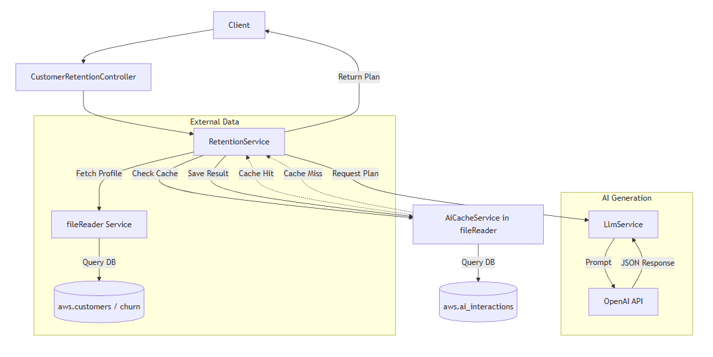
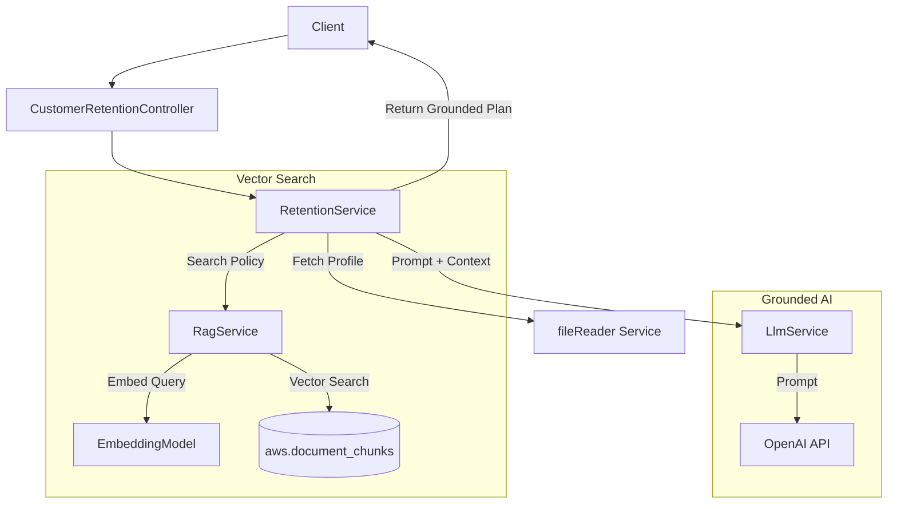
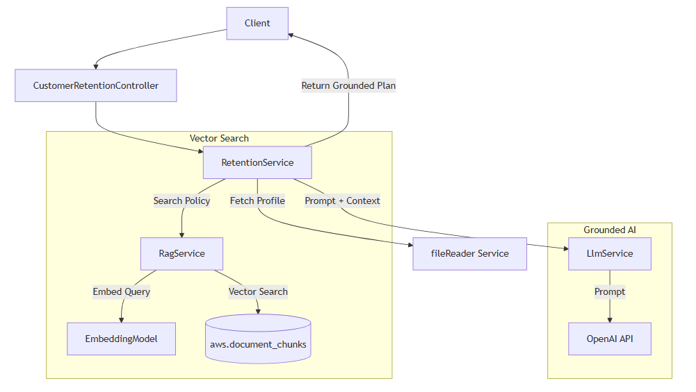
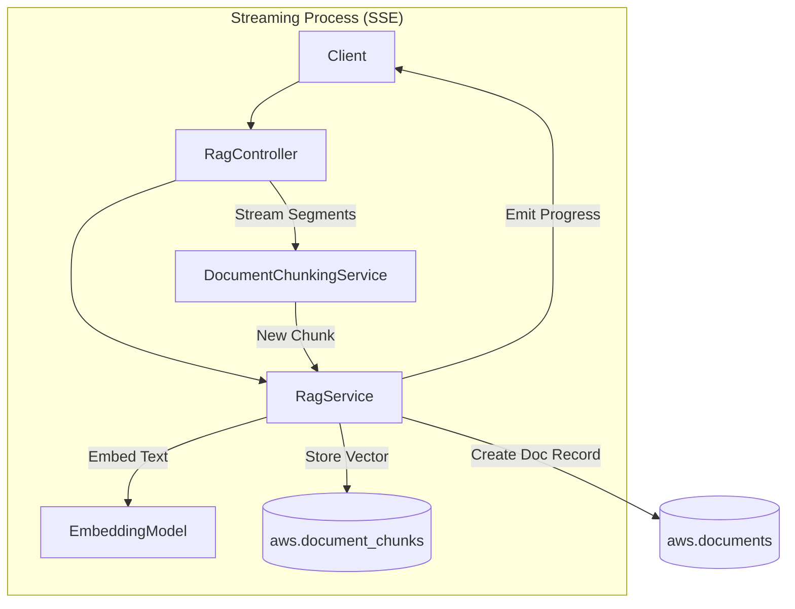
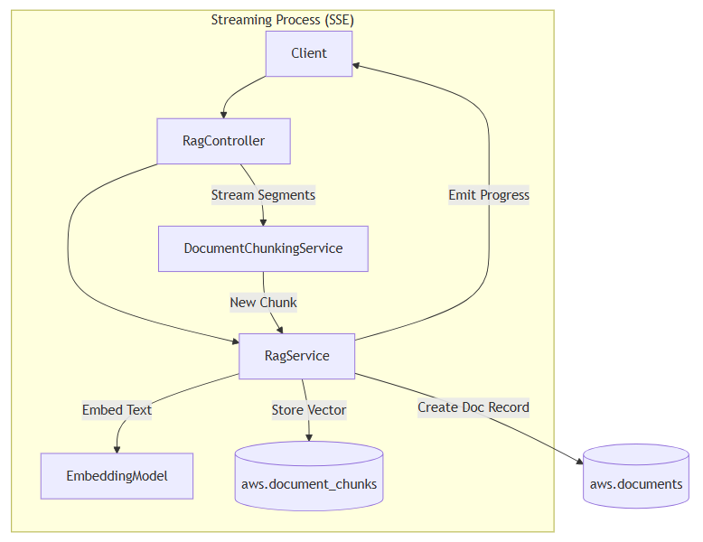
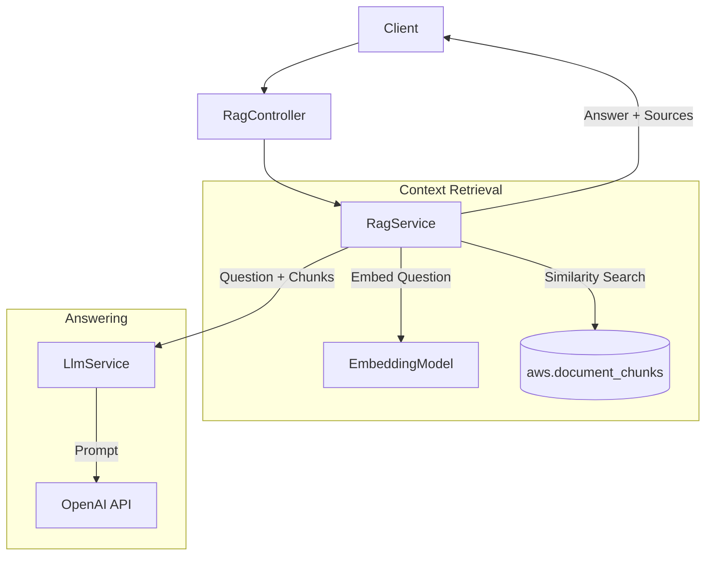
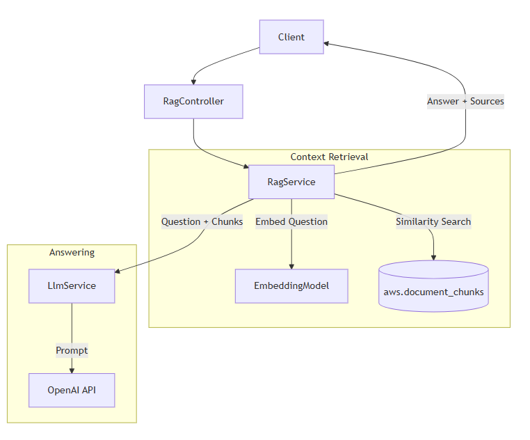

# API Flows - Mermaid Diagrams

This document illustrates the logical flow of key APIs in the system, showing the interactions between the API Controllers, Services, Databases, and LLM (OpenAI).

## 1. Customer Retention Analysis (`/retention/{id}/analyze`)

This flow shows how the system attempts to fetch a cached retention plan before falling back to AI generation.

---

## 2. RAG-Based Retention Analysis (`/retention/{id}/analyze/rag`)

This flow demonstrates how policy documents are retrieved from the vector database to ground the AI's retention recommendation.

---

## 3. General RAG Ingestion (`/rag/upload`)

This flow shows the streaming ingestion process where documents are chunked, embedded, and stored in the vector database.

---

## 4. Document Q&A (`/rag/{id}/ask`)

This flow illustrates the semantic search and context-based answering for a specific document.

